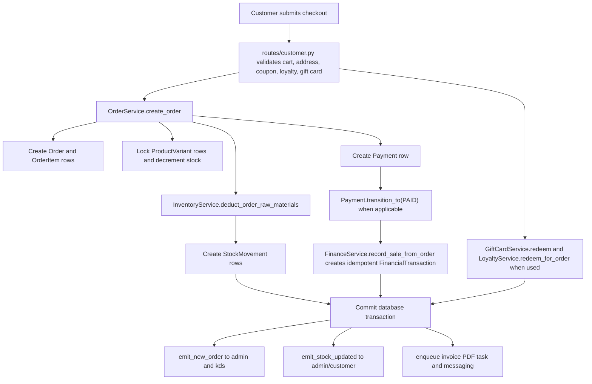

# SweetCrumbs Architecture

This document describes the current SweetCrumbs codebase as implemented. For setup,
deployment, and environment walkthroughs, see [README.md](README.md). This file is
focused on how the application is structured internally and how data moves through it.

## Tech Stack

Dependencies are declared in [requirements.txt](requirements.txt). `pyproject.toml`
currently contains project metadata and Black formatting configuration, not the runtime
dependency list.

| Dependency | Use in this application |
| --- | --- |
| Flask | Main web framework and application factory in [app.py](app.py). |
| Flask-SQLAlchemy / SQLAlchemy | ORM and schema definition for all application models under [models/](models/). |
| PyMySQL | MySQL-wire database driver used for TiDB/MySQL URLs such as `mysql+pymysql://...`. |
| psycopg[binary] | PostgreSQL driver support in config URL normalization; the primary documented database is TiDB. |
| Flask-Login | Session authentication, `current_user`, role checks, and route protection. |
| Flask-Bcrypt | Password hashing for users created through seed data, registration, admin staff, and delivery agent flows. |
| Flask-WTF | CSRF protection for form POSTs, initialized globally in `app.py`. |
| Flask-Limiter | Login rate limiting and other request limiting through the shared `limiter` extension. |
| Flask-Mail | Email delivery via Celery tasks and notification utilities. |
| Flask-Caching | Redis-backed or simple in-process cache for forecasts, route ETA cache, recommendation data, and analytics snapshots. |
| Flask-Migrate | Alembic migration integration. CI runs `python -m flask db upgrade` against MySQL. |
| Flask-SocketIO | Realtime order, stock, KDS, analytics, and delivery-assignment events across portals. |
| Flask-JWT-Extended / PyJWT | JWT extension initialized by the app and available to API routes. |
| Celery | Background task processing and beat schedule for sync, forecasts, subscriptions, metrics, backups, weather, invoices, loyalty, and cart reminders. |
| redis | Socket.IO message queue, Celery broker/result backend, cache, rate limiter, and health checks. |
| gunicorn / gevent / gevent-websocket | Production WSGI/WebSocket serving, especially for Render/Vercel-style deployments. |
| cryptography | Fernet encryption for selected financial ledger fields. |
| cloudinary | Optional product image and generated file storage through `StorageService`. |
| sentry-sdk | Optional production error monitoring through `init_sentry`. |
| Authlib | Google OAuth login flow in [routes/auth.py](routes/auth.py). |
| python-dotenv | Loads local environment variables in config utilities. |
| requests | Weather, Ollama, route-planning, and external HTTP integrations. |
| Pillow | Image handling support for uploaded/processed media. |
| qrcode[pil] | QR code generation for order verification and admin scanner flows. |
| reportlab | PDF generation for invoices and finance exports. |
| twilio | SMS and WhatsApp notification tasks. |
| email-validator | Email validation support for forms/user creation. |
| python-dateutil | Month/year period calculations in analytics and finance reports. |
| PyYAML | YAML support for scripts/configuration tooling. |
| tzlocal | Local timezone support. |
| firebase-admin | Optional Firebase Cloud Messaging push notifications. |

### Database

The production database is TiDB, a MySQL-wire-protocol-compatible distributed SQL
database, accessed through SQLAlchemy and PyMySQL. The code also supports SQLite for
local development/testing and local offline buffers, but production startup rejects
SQLite through `forbid_sqlite_in_production`.

TiDB/MySQL-specific handling in the codebase:

- `config/utils.py` normalizes `mysql://` to `mysql+pymysql://`.
- DB config assembled from `DB_HOST`, `DB_USER`, `DB_PASSWORD`, and `DB_NAME` defaults to port `4000`, matching TiDB Cloud's common MySQL endpoint.
- `DB_SSL_CA`, `DB_SSL_VERIFY_CERT`, and `DB_SSL_VERIFY_IDENTITY` are translated into PyMySQL SSL connect args.
- Engine options enable `pool_pre_ping`, `pool_recycle`, `pool_size`, `max_overflow`, and `pool_timeout`.
- Order and inventory updates use row locks such as `db.session.get(..., with_for_update=True)` for stock-sensitive operations.
- Revenue, order, finance, inventory, and delivery indexes are declared on frequently filtered columns such as order status/payment/date, financial transaction type/date, stock movement material/date, and delivery agent/status.

## Architecture Overview

### One Flask App, Three Portal Roles

SweetCrumbs is one Flask application factory in [app.py](app.py). It registers all
blueprints (`auth`, `customer`, `admin`, `delivery`, API v1, and optionally API v2),
then uses `PORTAL_ROLE` and per-blueprint request guards to decide which portal the
current process should expose.

Portal ports are defined in `PORTAL_PORTS`:

| Portal role | Local port | Main blueprint |
| --- | ---: | --- |
| `customer` | 5000 | [routes/customer.py](routes/customer.py) |
| `admin` | 5001 | [routes/admin.py](routes/admin.py) |
| `delivery` | 5002 | [routes/delivery.py](routes/delivery.py) |

`configure_app` sets `PORTAL_ROLE`, portal URLs, `SESSION_COOKIE_NAME`, and a
portal-specific offline sync SQLite path. The session cookie name is
`sweetcrumbs_{portal_role}_session`, which keeps customer/admin/delivery browser
sessions separate when all portals run locally.

All blueprints are registered, but portal guards limit exposure:

- Customer routes redirect admin/delivery users to their own portals when running
  outside the customer portal.
- Admin routes abort or redirect unless `PORTAL_ROLE == "admin"` and the user has an
  admin-portal role.
- Delivery routes abort unless `PORTAL_ROLE == "delivery"` and the user has role
  `delivery`.

### Realtime Layer

Socket.IO is initialized in `setup_extensions` with a Redis message queue when
`SOCKETIO_MESSAGE_QUEUE` or `REDIS_URL` is configured. `handle_socket_connect` joins
rooms based on the trusted Flask-Login session and a `portal` query parameter.

Rooms joined on connect:

- `customer`, `admin`, or `delivery` based on `?portal=...`.
- `customer_{user_id}` for authenticated customer sockets.
- `kds` for admin portal sockets.
- `delivery_{agent_id}` for authenticated delivery users with a `DeliveryAgent`
  profile. The agent id is derived from the logged-in user, not from the query string.
- `global` for all sockets.

Realtime helpers live in [realtime/events.py](realtime/events.py). They emit only to
explicit rooms and catch/log socket failures so realtime problems do not break HTTP
flows.

Events:

| Event | Trigger | Target rooms |
| --- | --- | --- |
| `new_order` | Online checkout, POS sale, subscription order generation | `admin`, `kds` |
| `order_status_updated` | Admin/delivery status changes | Customer room, admin/KDS where applicable, delivery-agent room for delivery-relevant updates |
| `order_updated` | Legacy/general order update helper | `admin`, `customer`, `kds`, and assigned delivery room for delivery-relevant statuses |
| `order_cancelled` | Cancellation workflow | `admin`, `kds`, customer room, assigned delivery room if present |
| `order_refunded` | Refund workflow | `admin`, `kds`, customer room, assigned delivery room if present |
| `stock_updated` | Product variant/raw material stock change | `admin`, plus `customer` for customer-visible product variant updates |
| `kds_refresh` | Kitchen display refresh helper | `admin`, `kds` |
| `delivery_assignment` | Admin assigns an order to an agent | `delivery_{agent_id}` only |
| `analytics_updated` | Celery analytics snapshot task | `admin` |

### Background Job Layer

Celery is configured in `setup_celery`. If broker/backend values are missing, the app
still boots but does not have a usable worker connection. Production config requires
Redis-backed Celery values.

Beat schedule in [config/base.py](config/base.py):

| Schedule key | Task | Interval |
| --- | --- | ---: |
| `inventory-forecasts-nightly` | `tasks.operations.build_inventory_forecasts` | 6 hours |
| `subscription-order-generator` | `tasks.operations.generate_subscription_orders` | 24 hours |
| `offline-sync-retry` | `tasks.operations.retry_offline_sync_actions` | 60 seconds |
| `queue-metrics-capture` | `tasks.operations.capture_queue_metrics` | 5 minutes |
| `backup-health-verification` | `tasks.operations.verify_backup_health` | 12 hours |
| `analytics-aggregate` | `tasks.operations.aggregate_analytics_snapshot` | 30 minutes |
| `weather-forecast-refresh` | `tasks.operations.refresh_weather_forecast` | 6 hours |
| `birthday-loyalty-rewards` | `tasks.operations.process_birthday_rewards` | 24 hours |
| `abandoned-cart-reminders` | `tasks.operations.send_abandoned_cart_reminders` | 2 hours |

Additional Celery tasks include invoice PDF generation and email/SMS/WhatsApp
messaging. Core checkout, POS sale creation, stock deduction, payment state changes,
and finance ledger creation are synchronous request/transaction work. After commits,
routes emit Socket.IO events and enqueue non-critical background jobs such as invoice
generation.

### Request Flow Diagram



For POS, `routes/admin.py` calls the same `OrderService.create_order` path with
`channel="counter"` and `source="POS"`. For subscriptions, `SubscriptionService`
generates an order through the same service but creates a manual payment link and
leaves the payment pending.

## Data Model And Data Handling

Model exports are centralized in [models/__init__.py](models/__init__.py). Major
groups:

- **Users and auth**: `User`, `LoginHistory`, and legacy `Subscription` live in
  [models/user.py](models/user.py). `User.role` stores broad portal role;
  `User.admin_tier` refines admin access.
- **Catalog**: `Category`, `Product`, `ProductVariant`, and `Review` in
  [models/product.py](models/product.py). Products can have variants, recipe
  materials, reviews, fallback images, and active/featured flags.
- **Cart and addresses**: `Cart`, `Wishlist`, `SavedAddress` in
  [models/cart.py](models/cart.py).
- **Sales orders**: `Order`, `OrderItem`, `AddressChange`, and
  `ModificationRequest` in [models/order.py](models/order.py). Orders track channel,
  source, fulfillment type, status, payment status, totals, discounts, GST, gift-card
  redemption, QR data, sync versions, and lock/version metadata.
- **Payments**: `Payment`, `PaymentLink`, `Refund`, `Coupon`, and
  `PaymentTransitionLog` in [models/payment.py](models/payment.py). `Payment` owns
  state transitions and writes transition-log rows.
- **Inventory**: `RawMaterial`, `ProductMaterial`, `StockMovement`, `Supplier`,
  `Branch`, `ProductionPlan`, and `ProductionBatch` in
  [models/inventory.py](models/inventory.py). Recipe deductions and manual restocks
  are represented through stock movements.
- **Delivery**: `DeliveryAgent` and `Delivery` in [models/delivery.py](models/delivery.py).
  Delivery assignment is per agent and delivery routes can be planned separately.
- **Communication**: `Message`, `Notification`, and `EmailLog` in
  [models/communication.py](models/communication.py).
- **Finance and tax**: `FinancialCategory`, `TaxRate`, `FinancialTransaction`, and
  `TaxRecord` in [models/finance.py](models/finance.py). `FinancialTransaction`
  records income, expense, and liability rows.
- **Vendors and procurement**: `Vendor`, `VendorProduct`, `PurchaseOrder`, and
  `PurchaseOrderItem` in [models/vendor.py](models/vendor.py). Receiving a purchase
  order creates inventory movements and a finance expense transaction.
- **Recurring subscriptions**: `RecurringSubscription`, `SubscriptionItem`, and
  `SubscriptionOrderLog` in [models/recurring_subscription.py](models/recurring_subscription.py).
- **Gift cards**: `GiftCard` and `GiftCardTransaction` in
  [models/gift_card.py](models/gift_card.py).
- **Loyalty**: `LoyaltyLedger`, plus cashback/referral models in
  [models/loyalty.py](models/loyalty.py) and [models/operations.py](models/operations.py).
- **Operations and audit**: `AuditLog`, `OperationalAlert`, `InventoryForecast`,
  `LocalEvent`, `WeatherSnapshot`, `DeliveryRoutePlan`, staff/attendance/salary,
  queue, API usage, fraud, push device, pricing, subscription schedule, wallet,
  referral, and sync conflict models in [models/operations.py](models/operations.py).

### Append-Only Ledger Pattern

The code favors append-only trails for financially or operationally sensitive
history:

- `StockMovement` records every raw-material increase/decrease/reversal.
- `FinancialTransaction` records income, expense, liability, refund, restock, and
  purchase-order finance events.
- `PaymentTransitionLog` records payment state transitions.
- `LoyaltyLedger` records earns, redemptions, referrals, birthdays, and manual
  adjustments.
- `GiftCardTransaction` records issue, redemption, cancellation, and manual
  adjustments.
- `AuditLog` records admin/security/operational changes and alerts.

This matters because reports and investigations can reconstruct what happened rather
than only seeing the latest mutable balance. Some current routes still update master
records such as `Order.status`, `GiftCard.current_balance`, or `RawMaterial.stock`;
the append-only rows are the history/audit trail around those mutable current-state
fields.

### Financial Encryption

Financial encryption is implemented in [models/encrypted_types.py](models/encrypted_types.py)
using `cryptography.Fernet` through SQLAlchemy `TypeDecorator` classes:

- `EncryptedDecimal`
- `EncryptedText`

Encrypted fields on `FinancialTransaction`:

- `amount`
- `tax_amount`
- `description`
- `counterparty`
- `tds_withheld`

The encryption key is read from `FINANCIAL_DATA_ENCRYPTION_KEY`. In non-production
development, `ALLOW_DEV_FINANCIAL_KEY_DERIVATION` can derive a key from `SECRET_KEY`;
testing config provides its own test key. Do not store or document actual key values.

### Order Lifecycle And Side Effects

Order statuses are declared in [models/order.py](models/order.py):

`PLACED`, `PREPARING`, `PACKED`, `READY_FOR_PICKUP`, `OUT_FOR_DELIVERY`,
`DELIVERED`, `ON_HOLD`, `CANCELLED`, and `REFUNDED`.

Allowed status transitions are stored in `ORDER_STATUS_TRANSITIONS`. Delivery actors
can only choose delivery-relevant statuses from the current transition list.

Important side effects:

- **Checkout/POS/subscription creation**: `OrderService.create_order` creates the
  order, order items, locks/decrements product variants, deducts recipe raw materials,
  creates stock movements, creates a payment row, and records sale finance rows when
  payment is immediately marked paid.
- **Payment paid**: `Payment.transition_to("PAID")` updates the payment/order payment
  status, logs a `PaymentTransitionLog`, and calls
  `maybe_record_sale_on_payment`, which creates an idempotent sales
  `FinancialTransaction`.
- **Status update**: `OrderService.update_order_status` validates the transition,
  updates version/sync metadata, syncs delivery state, records audit, commits, and
  publishes a domain event. Routes then emit Socket.IO updates.
- **Delivered**: loyalty points are awarded only for paid delivered orders and only
  once per order.
- **Delivery assignment**: admin creates/updates a `Delivery`, marks the agent
  unavailable, plans the route, emits `delivery_assignment` to the specific
  `delivery_{agent_id}` room, and sends a push notification when configured.
- **Cancellation/refund**: `OrderReversalService` changes status to `CANCELLED` or
  `REFUNDED`, optionally reverses stock through new movement rows, transitions payment
  to refunded/cancelled, creates refund records and finance refund rows, frees delivery
  assignment state, logs audit, and emits reversal/stock events after commit.

## Feature Areas

### Realtime Sync

Implemented by [app.py](app.py), [realtime/events.py](realtime/events.py),
[static/js/main.js](static/js/main.js), and portal templates that load Socket.IO.
Room-based events update admin order lists, KDS, delivery assignments, customer order
details, stock indicators, and analytics summaries. Emits are room-targeted and
wrapped so socket failures do not block the HTTP response.

### Analytics

Implemented by [services/analytics_service.py](services/analytics_service.py),
admin analytics routes in [routes/admin.py](routes/admin.py), and
[templates/admin/analytics.html](templates/admin/analytics.html). Revenue counts only
delivered, paid orders and includes gift-card redemption amount as realized sales.
Trends group by hour/day/month using database-specific date functions for MySQL or
SQLite. Finance dashboards reuse these analytics helpers for sales numbers.

### Inventory

Implemented by [services/inventory_service.py](services/inventory_service.py),
inventory/raw-material/admin product routes in [routes/admin.py](routes/admin.py),
and inventory models. Product variants track sellable stock; `RawMaterial` and
`ProductMaterial` model recipes. Order creation deducts product variant stock and raw
materials with row locks. Manual raw-material changes create `StockMovement` rows and
audit entries. Product variant edits update current stock directly and emit realtime
stock updates; raw-material movements provide the more explicit audit ledger.

### AI And Demand Assistance

Implemented AI-adjacent features:

- Product recommendations and customer chat use [recommendation_engine.py](recommendation_engine.py).
  The engine works without optional ML libraries by using keyword/rule/trending
  ranking; FAISS/sentence-transformers/llama are optional.
- Smart triage uses [services/triage_service.py](services/triage_service.py) to group
  pending orders by material fulfillability. If `llama_cpp` and `LLM_MODEL_PATH` are
  available, the LLM rewrites deterministic notes; otherwise deterministic notes are
  used.
- Review reply assistance uses [services/review_reply_service.py](services/review_reply_service.py)
  for attention flags and optional LLM-generated reply drafts.
- Demand insights use [services/demand_service.py](services/demand_service.py),
  [services/weather_service.py](services/weather_service.py), `LocalEvent`, and
  `WeatherSnapshot`. Forecast/weather/event signals are deterministic; Ollama phrasing
  is used only when `DEMAND_USE_OLLAMA` is enabled and Ollama responds.

I did not find a distinct implemented module or route named for AI sizing. If "sizing"
means a previous planned cake-sizing assistant, that feature is not identifiable as a
separate current implementation in this codebase.

### Financial And Tax Reporting

Implemented by [services/finance_service.py](services/finance_service.py),
[services/finance_export_service.py](services/finance_export_service.py), finance
models, migrations, and `/admin/finance` routes. The finance service provides:

- Default categories for sales, liability, raw material purchase, rent, utilities,
  salary, refunds, and other income/expense.
- Sales revenue tied to delivered paid orders from analytics.
- Product and store ledger reporting.
- GST collected/paid/net liability and TDS/withholding summaries.
- Indian financial year bounds of April 1 through March 31.
- Consistency checks for order revenue vs sales ledger rows.
- CSV/PDF export routes for dashboard, sales, P&L, category breakdown, product/store
  ledgers, vendor spend, GST, and financial-health views.

Tax snapshots are saved as review records; the code does not file GST/TDS returns.

### Refunds And Cancellations

Implemented by [services/order_reversal_service.py](services/order_reversal_service.py)
and admin/customer order routes. Pending unpaid orders can be cancelled; paid orders
use the refund workflow before delivery. Delivered orders are deliberately excluded
from this workflow and the admin template calls out that a separate post-delivery
refund path is needed.

Known limitation: the current reversal service handles full-order refund/reversal
only. Partial refunds and partial stock reversals are documented as strict expected
failures in [tests/test_money_stock_scenarios.py](tests/test_money_stock_scenarios.py).
Gift-card redemption restoration on refund is also not fully defined.

### Counter POS

Implemented by `/admin/pos` in [routes/admin.py](routes/admin.py),
[templates/admin/pos.html](templates/admin/pos.html), and the shared order service.
POS creates counter-channel orders through the same stock/payment/finance pipeline as
online checkout. If the DB is offline and the sale has one line item, the sale can be
queued through `OfflineSyncService` and later replayed.

### Vendor Management And Purchase Orders

Implemented by vendor/purchase-order routes in [routes/admin.py](routes/admin.py),
[models/vendor.py](models/vendor.py), and
[services/purchase_order_service.py](services/purchase_order_service.py). Vendors can
have GSTIN metadata and product/material mappings. Receiving a purchase order
increases raw-material stock, records `StockMovement` rows with reason
`purchase_order_received`, upserts vendor-product cost data, and creates an auto
generated raw-material purchase finance transaction. GST input tax credit is recorded
only when the vendor has a GSTIN and the purchase order has a GST rate.

### Loyalty

Implemented by [models/loyalty.py](models/loyalty.py),
[services/loyalty_service.py](services/loyalty_service.py), customer checkout, and
admin loyalty routes. Customers earn points for paid delivered orders and can redeem
points during checkout subject to configured earn/redeem rates and caps. Admin
adjustments create ledger entries and are manager/owner-only.

### Subscriptions

Implemented by [models/recurring_subscription.py](models/recurring_subscription.py),
[services/subscription_service.py](services/subscription_service.py), customer
subscription routes, admin subscription views, and a daily Celery task. Subscription
cycles generate normal orders through `OrderService`, create `SubscriptionOrderLog`
rows, advance `next_scheduled_date`, notify users/admins, and emit realtime order and
stock events after commit.

Limitation: recurring orders are created as payment-pending with a manual payment
link. Tokenized recurring payment gateway support is not integrated.

### Gift Cards

Implemented by [models/gift_card.py](models/gift_card.py),
[services/gift_card_service.py](services/gift_card_service.py), customer gift-card
purchase/redemption, and admin gift-card routes. Issuing a card creates a
`GiftCardTransaction` and a finance liability transaction. Redemption locks the card,
reduces current balance, and adds a redemption transaction. Manual adjustments and
cancellations add transaction rows and require manager/owner access.

Known limitation: refund-time gift-card balance restoration is not fully implemented.

### Audit Logging And Operations

Implemented by [services/audit_service.py](services/audit_service.py),
[models/operations.py](models/operations.py), admin audit routes, and many service
side effects. The audit service records admin permission denials, stock changes,
financial transactions, purchase-order receipt, POS sales, order status changes,
offline sync events, fraud alerts, and operational alerts. Owner-only admins can view
the audit log.

### Offline Sync And PWA Support

Admin and delivery portals have manifests/service-worker routes and an
`OfflineSyncService`. The offline service stores local SQLite snapshots and action
queues under `instance/offline/{portal_role}_offline_sync.sqlite`, checks TiDB/Redis
connectivity, replays queued actions when online, and records conflicts in
`SyncConflict`. This local SQLite store is an offline buffer only; TiDB remains the
source of truth.

### Delivery And Route Planning

Implemented by [routes/delivery.py](routes/delivery.py),
[services/delivery_service.py](services/delivery_service.py), and
[services/route_planning_service.py](services/route_planning_service.py). Delivery
agents see only their own assigned deliveries. ETA uses Google Distance Matrix when
`GOOGLE_MAPS_API_KEY` is configured; otherwise it falls back to haversine distance.

## Roles And Permissions

### Portal Roles

`User.role` remains the broad role gate:

- `customer`: storefront, cart, checkout, profile, saved addresses, orders, reviews,
  subscriptions, gift cards, chat, and invoices.
- `delivery`: delivery dashboard, assigned delivery detail, status updates, COD
  collection, and delivery history.
- Admin-portal roles: `admin`, `super_admin`, `branch_manager`, `cashier`, and
  `kitchen_staff` can enter the admin portal, with effective tiers described below.

### Admin Tiers

Admin tier logic is in [utils/permissions.py](utils/permissions.py),
[models/user.py](models/user.py), and `require_admin_tier` in
[routes/admin.py](routes/admin.py).

Effective tier mapping:

- `super_admin` -> owner
- `branch_manager` -> manager
- `cashier` / `kitchen_staff` -> staff
- `admin` -> `User.admin_tier`, defaulting to owner

Backend decorators:

- `owner_required`: owner only.
- `finance_required`: owner only.
- `manager_required`: manager or owner.
- `operations_required`: staff, manager, or owner.

Access summary from current route decorators:

| Tier | Examples of allowed sections |
| --- | --- |
| staff | Dashboard, orders, order detail/status, modifications, inventory, raw materials, KDS, POS, vendor/purchase-order list/detail, QR scanner. |
| manager | Staff access plus triage, demand insights, products/categories, refunds/cancellations, reviews/review drafts, customers, chat, suppliers, vendor/PO creation/editing/receipt, branches, production, batches, coupons, loyalty, gift cards, agents listing, forecasts, subscriptions, pricing, offline/sync, queues, route planning. |
| owner | Manager access plus finance, tax rates, finance exports, staff management, audit log, delivery-agent account creation/reset/toggle. |

The admin sidebar uses `can_admin_owner`, `can_admin_manager`, and
`can_admin_operations` from the admin context processor to hide inaccessible links.
The decorators remain the security boundary.

## Testing And CI

Run tests locally:

```bash
python -m pytest -q
```

Useful targeted checks:

```bash
python scripts/check_migration_heads.py
python -m pytest tests/test_realtime_events.py -q
python -m pytest tests/test_finance.py tests/test_financial_calculations.py -q
```

Test categories currently present:

- `tests/test_routes.py`: route smoke tests and portal behavior.
- `tests/test_independent_apps.py`: independent portal/session behavior.
- `tests/test_admin_tiers.py`: admin tier access and nav visibility.
- `tests/test_realtime_events.py` and `tests/test_realtime_delivery.py`: Socket.IO
  rooms and delivery-specific realtime events.
- `tests/test_finance.py`, `tests/test_financial_calculations.py`, and
  `tests/test_encryption.py`: financial dashboard, exports, reconciliation, and
  encrypted field behavior.
- `tests/test_money_stock_scenarios.py`: end-to-end money/stock/refund/gift-card
  scenarios, including documented expected failures.
- `tests/test_pos_counter_sales.py`: POS shared pipeline and stock competition.
- `tests/test_stock_deduction.py`: recipe/material deduction behavior.
- `tests/test_order_reversals.py`: cancellation/refund workflow.
- `tests/test_vendor_purchase_orders.py`: procurement, stock, and GST input-credit
  behavior.
- `tests/test_gift_cards.py`: gift-card issue/redemption/accounting behavior.
- `tests/test_loyalty_rewards.py`: loyalty earn/redeem/adjust behavior.
- `tests/test_recurring_subscriptions.py`: subscription order generation and failure
  logging.
- `tests/test_demand_insights.py`: demand insight rendering and data sufficiency.
- `tests/test_review_replies.py`: review moderation and reply drafts.
- `tests/test_production_features.py`: production configuration behavior.
- `tests/test_database_schema.py`: migration/schema guardrails.
- `tests/test_full_app_audit.py`: audit coverage for CSRF response behavior, IDOR,
  staff-sensitive access, socket failure tolerance, and AI fallback.

CI is defined in [.github/workflows/ci.yml](.github/workflows/ci.yml). On every push
and pull request it:

1. Starts a MySQL 8.0 service.
2. Installs `requirements.txt` plus `pytest` on Python 3.11.
3. Runs `python scripts/check_migration_heads.py`.
4. Runs `python -m flask db upgrade` and `python -m flask db current`.
5. Runs `python -m pytest -q`.

CI sets required environment variables by name, including `DATABASE_URL`,
`FINANCIAL_DATA_ENCRYPTION_KEY`, `SECRET_KEY`, and testing/offline flags. Secret
values should remain in CI configuration, not in documentation.

## Known Limitations And Honest Gaps

- **Partial refunds are not implemented.** `OrderReversalService` refunds
  `order.total` and reverses full-order stock when reversal is requested. The desired
  partial refund behavior is captured as a strict expected failure.
- **Gift-card refund restoration is incomplete.** Redeemed gift-card value is counted
  in realized sale revenue, but refund workflow does not restore redeemed balance or
  fully settle the gift-card redemption case.
- **Delivered-order refunds are intentionally excluded.** Admin UI states delivered
  orders need a future post-delivery refund workflow for quality claims, returns, and
  tax review.
- **Recurring subscription billing is manual-link based.** The app generates orders
  and payment links; it does not charge stored/tokenized payment methods.
- **AI sizing is not identifiable as a separate implemented feature.** Current AI
  features cover recommendations/chat, triage wording, review replies, and demand
  narrative phrasing.
- **AI and external advisory services degrade gracefully.** Weather, Ollama, Google
  Maps, email, SMS/WhatsApp, Firebase, Cloudinary, and Sentry are optional/configured
  integrations. Missing keys usually disable or degrade that feature rather than
  blocking core ordering.
- **Analytics snapshot task uses Python-side order iteration.** Most reporting paths
  use aggregate SQL queries, but `aggregate_analytics_snapshot` currently loads all
  orders and sums in Python; this should be converted to a SQL aggregate before large
  production data volumes.
- **Some money-adjacent helpers still serialize or calculate with floats.** Core order
  totals and finance records use `Decimal`/`Numeric`, but coupon/loyalty helpers and
  JSON/chart outputs contain float conversions. Avoid extending those float paths for
  authoritative accounting.
- **Offline sync is scoped.** It queues selected admin/delivery actions such as stock
  updates, order/delivery status changes, COD collection, and simple POS sales. It is
  not a general bidirectional database replication system.
- **Financial reports are review aids, not filings.** GST/TDS snapshots and exports
  are generated from recorded transactions and should be reviewed before statutory
  filing.

